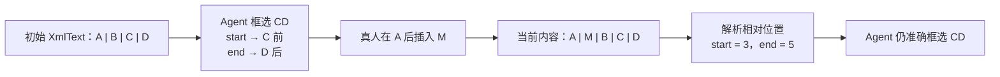

# 解决框选下标偏移的细节内容



## 1. Agent 如何控制光标和选区

Agent 没有浏览器里的真实光标，它维护的是一份“协作光标状态”：

```ts
type AgentCursorState = {
  actorId: string
  actorType: 'AGENT'
  name: string
  color: string
  anchor: Y.RelativePosition
  head: Y.RelativePosition
}
```

- 光标：`anchor === head`
- 选区：`anchor !== head`
- 选区方向由 `anchor` 与 `head` 保留
- 前端把该状态作为协作 Presence/Awareness 渲染成 Agent 光标、姓名标签与选区高亮

对于 `ABCD`，Agent 框选 `CD`：

```ts
import * as Y from 'yjs'

const start = Y.createRelativePositionFromTypeIndex(xmlText, 2, 0)
const end = Y.createRelativePositionFromTypeIndex(xmlText, 4, -1)
```

其中：

```text
初始文本：A B C D
绝对位置：0 1 2 3 4

选区：    [   C D   )
           2       4
```

此时不要持久化 `2` 和 `4`，而是持久化 `start` 与 `end` 的编码结果：

```ts
const startBytes = Y.encodeRelativePosition(start)
const endBytes = Y.encodeRelativePosition(end)
```

它们可以存为 PostgreSQL `bytea`，或 Base64 字符串。

当真人在 `A` 后插入 `M`：

```text
原文：ABCD
改后：AMBCD

原选区绝对下标：2..4
新选区绝对下标：3..5
```

Agent 在真正提交前重新解析：

```ts
const startAbsolute = Y.createAbsolutePositionFromRelativePosition(start, ydoc)
const endAbsolute = Y.createAbsolutePositionFromRelativePosition(end, ydoc)

if (!startAbsolute || !endAbsolute) {
  throw new Error('目标节点已经不存在')
}

const from = startAbsolute.index // 3
const to = endAbsolute.index     // 5
const current = xmlText.toString().slice(from, to) // CD
```

因此，插入发生在选区外部时，选区会自然随其所锚定的 CRDT 内容移动。

但相对位置只解决“位置跟随”，不保证“目标语义仍正确”。所以 Agent 提交前必须再验证局部指纹：

```ts
const expectedText = 'CD'
const expectedFingerprint = sha256(expectedText)

const actualText = xmlText.toString().slice(from, to)
if (sha256(actualText) !== expectedFingerprint) {
  return { status: 'CONFLICTED' }
}
```

例如：

```text
初始：ABCD
Agent 目标：CD

真人改为：ABXD
```

相对位置仍可能解析成功，但目标片段已不是 `CD`。此时 Agent 必须停止覆盖，重新读取局部内容。

所以完整原则是：

> RelativePosition 负责跟随内容；局部指纹负责防止错误覆盖。

## 2. 边界插入的语义

选区边界本身可能被并发插入，因此创建相对位置时要规定关联方向。

首发将边界规则固定为：**只有原选区内的文本变化才冲突；恰好在选区两侧插入的文本不属于选区。**

例如 Agent 在 `abcd` 中框选 `bc`：

```text
原文：       a [ b c ] d
真人左侧插入：a m [ b c ] d  →  当前选区仍为 bc，不冲突
真人右侧插入：a [ b c ] m d  →  当前选区仍为 bc，不冲突
真人内部插入：a [ b m c ] d  →  当前选区变为 bmc，发生冲突
```

因此 Agent 后续替换的仍是原有 `bc`；左右两侧插入的 `m` 不会被一并替换。对于单个 `Y.XmlText`，起点固定使用 `assoc = 0`（关联右侧），终点固定使用 `assoc = -1`（关联左侧）。

这里的“边界插入”按选区的逻辑位置定义：位于 `from` 的插入归为左侧，位于 `to` 的插入归为右侧，均不属于选区；只有严格落在两端之间的插入属于选区。业务代码不得自行选择其他 `assoc` 组合。

这部分不要让各业务代码直接散落地传 `assoc` 参数。应封装为唯一的范围服务：

```ts
function createProtectedTextRange(xmlText: Y.XmlText, from: number, to: number) {
  return {
    start: Y.createRelativePositionFromTypeIndex(xmlText, from, 0),
    end: Y.createRelativePositionFromTypeIndex(xmlText, to, -1)
  }
}
```

后续通过协同测试固定上述规则，包括：

- 在选区前插入；
- 在选区后插入；
- 在选区起点（左侧）插入；
- 在选区终点（右侧）插入；
- 在选区内部插入；
- 删除整个选区；
- 删除选区所属节点。

### 2.1 跨节点选区：不引入业务 `blockId`

`ABCD` 不一定处在同一个 `Y.XmlText`。在 Tiptap 文档中，换段、标题、列表项或其他块级节点都可能使：

```text
paragraph  -> Y.XmlText("ABC")
heading    -> Y.XmlText("D")
```

因此，跨普通文档节点的选区是正常情况。这里的“节点”只是 Tiptap/Yjs 文档结构的描述，不是首发新增的 `block` 领域模型。

首发**不需要**为每一个 paragraph、heading、listItem 额外写入业务 `blockId`。Yjs 的 `RelativePosition` 已含有其所在 Yjs Item/Type 的稳定内部身份；Tiptap 的 `@tiptap/y-tiptap` 已能在 ProseMirror 文档位置与 Yjs RelativePosition 之间双向映射，且这个位置可以跨节点。

`blockId` 仅在需要下列业务能力时再引入：

- 对单个节点做长期的业务引用、评论、权限或审核；
- 保存独立的节点 revision；
- 将节点作为可独立恢复、接受或拒绝的业务实体。

跨节点的准备结果应保存两个端点及其文本校验材料，而不是保存全局文本下标：

```ts
type PreparedRange = {
  agentRunId: string
  start: Uint8Array // encodeRelativePosition(start)
  end: Uint8Array   // encodeRelativePosition(end)
  expectedTextFingerprint: string
  createdAt: number
}
```

首发只校验文本指纹，以减少实现改动：在准备和提交时，都使用当前 ProseMirror 文档的 `doc.textBetween(from, to, '\n')` 取得选区纯文本，再对该字符串的**原始 UTF-8 字节**计算 `sha256`。段落边界统一按 `\n` 表示；不做 Unicode、空白或格式归一化，也不校验 mark、节点属性或节点结构。

这意味着只要端点仍能映射、选区文本未变，就允许段落合并、拆分等不改变选区文本的普通编辑继续通过当前 Schema 的 transaction 提交。首发不引入结构指纹、节点 revision 或 `blockId`。

### 2.2 跨节点的提交方式

跨节点不能复用 `replaceIfUnchanged` 中对一个 `Y.XmlText` 的 `delete + insert`。该函数的 `start.type !== xmlText || end.type !== xmlText` 检查应继续保留，用来明确拒绝把跨节点范围误当成单节点文本范围。

跨节点的流程应为：

```text
ProseMirror selection 的 from/to
  → 映射为两个 Y.RelativePosition
  → 保存文本指纹
  → 提交前重新映射为当前 ProseMirror from/to
  → 校验端点与文本内容
  → 通过 Tiptap / ProseMirror transaction 替换该选区
  → Collaboration Binding 生成普通 Yjs update
```

也就是说，Yjs 负责端点跟随；结构化编辑仍应由与当前 Tiptap Schema 对齐的适配层完成。Agent 不应自行把跨节点的 XML 删除、节点拼接逻辑散落到业务代码中。

首发允许选区跨普通段落，替换仍由当前 Schema 校验。`replaceRange(rangeRef, replacement)` 的 `replacement` 只能是无换行、无 mark、无富文本的纯文本；跨段后的节点合并或保留完全采用该 Schema transaction 的结果。表格、图片、引用和其他复杂节点不在首发范围，返回 `UNSUPPORTED`；端点无法映射或其顺序无效返回 `INVALID_RANGE`；Schema 不接受替换返回 `SCHEMA_REJECTED`。不做降级 XML 拼接。

### 2.3 删除、合并和“局部最新”

如果同一文本节点的 `ABC` 变为 `AB`，并且 Agent 的端点原来关联 `C`，Yjs 通常会把该相对位置解析到删除后的边界，而不是必然返回 `null`。所以“RelativePosition 可解析”不等于“目标仍然正确”：原本期望的 `C` 已不存在，文本指纹必须校验失败并返回 `CONFLICTED`。

如果整个 `C` 所在节点或其祖先节点被删除，端点可能无法解析，此时返回 `INVALID_RANGE`。首发不因段落合并、拆分等结构变化单独冲突；只要端点可映射且按 `doc.textBetween(from, to, '\n')` 得到的文本指纹一致，即可交由当前 Schema 校验并提交。表格和其他未纳入首发范围的复杂节点则直接返回 `UNSUPPORTED`。

首发的“局部最新”只有一个最终判断：

```text
两个 RelativePosition 均可解析且顺序有效
  + 当前选区纯文本指纹一致
  = 可以在 Worker 的同文档串行队列中提交
```

这是一项**乐观校验**：Worker 会先处理校验前已收到的远端 update，再立即提交；若真人 update 与提交真正同时抵达，Yjs 仍按 CRDT 规则合并。首发不增加服务端原子 compare-and-commit，不锁定真人编辑。

现有 Yjs update、op log 和 snapshot 都是文档级；首发不维护节点 revision，也不为此引入 `blockId`。

## 3. Agent 如何读取 Yjs XML 文档

Tiptap 的协作内容通常存放在：

```ts
const root = ydoc.getXmlFragment('content')
```

其内部不是一个普通字符串，而是类似这样的 Yjs XML 树：

```text
Y.XmlFragment(content)
└── Y.XmlElement(paragraph)
    └── Y.XmlText("ABCD")
```

复杂文档可能是：

```text
Y.XmlFragment(content)
├── Y.XmlElement(heading)
│   └── Y.XmlText("项目背景")
├── Y.XmlElement(paragraph)
│   └── Y.XmlText("ABCD")
└── Y.XmlElement(bullet_list)
    └── ...
```

Agent 不应该直接看到 Yjs 二进制，也不应自己生成 XML/Yjs 操作。

应由 Node/TypeScript Yjs Worker 中的 Document Engine 把 Yjs XML 树投影为 Agent 可理解的结构：

```ts
type AgentDocumentProjection = {
  documentId: string
  nodes: Array<{
    ref: string
    type: 'heading' | 'paragraph' | 'listItem'
    text: string
    attributes: Record<string, string>
  }>
}
```

例如：

```json
{
  "documentId": "doc_001",
  "nodes": [
    {
      "ref": "node_7",
      "type": "paragraph",
      "text": "ABCD",
      "attributes": {}
    }
  ]
}
```

其中 `ref` 是 Document Engine 为本次 projection 生成的不透明定位句柄：只在该次 Agent 操作链路中使用，不能作为持久化业务 ID，也不等同于 `blockId`。这里的 `node` 同样只是投影中的文档节点，不创建新的业务实体。后续确有评论、权限、独立审核等业务需求时，再单独引入稳定的业务身份。

Agent 可以读到：

```text
[node_7]
ABCD
```

模型不应直接提交：

```json
{ "from": 2, "to": 4 }
```

也不应提交 projection 中的字符下标。首发通过“引用文本 + 上下文”描述两个边界：

```ts
type BoundaryHint = {
  ref: string
  before?: string // 边界左侧的引用文本；节点开头时可为空
  after?: string  // 边界右侧的引用文本；节点结尾时可为空
}

prepareRange({ start: BoundaryHint, end: BoundaryHint })
```

Engine 仅在每个边界可唯一定位且 `start <= end` 时创建范围；引用文本重复、上下文不足或端点无法唯一定位时，返回 `AMBIGUOUS_SELECTION`，要求 Agent 补充上下文，而不是任意命中一个。跨段选择由 Document Engine 基于两个 projection `ref` 和各自边界创建同一个 `PreparedRange`；Agent 仍只获得最终的 `rangeRef`，不接触 Yjs 内部坐标。

Node/TypeScript Worker 定位后生成并保存真实的 `RelativePosition`、局部文本指纹和上下文信息，返回一个不透明引用：

```json
{
  "rangeRef": "range_01J...",
  "selectedText": "CD"
}
```

Agent 后续只使用：

```text
replaceRange(range_01J..., "新的内容")
```

而不是接触 Yjs 内部坐标。`rangeRef` 仅属于创建它的 Agent run，且只能提交一次：成功、冲突、取消、创建后 10 分钟超时都会使其失效；再次使用返回 `RANGE_EXPIRED`。

### 3.1 现有实现提供的基础与尚缺的能力

现有前端已经以 `Y.Doc + Y.XmlFragment('content')` 绑定 `@tiptap/extension-collaboration`，因此具备跨节点位置映射和原始 Yjs update 同步的基础。Document WebSocket 也能持久化、确认和广播合法的 Yjs update。

但现有实现尚未提供下列 Agent 层能力，不能把“已有协作编辑器”误解为“已有 Agent 跨节点编辑”：

- Agent 的 prepare / validate / commit 范围服务；
- Agent 光标、选区的 awareness 渲染；
- 页面关闭后仍可运行的 Agent Writer；
- Worker 内部每文档的 Agent 串行队列。

首发由 `core-agent` 的 Java 层负责编排、Agent run 与审计记录；仓库内受管的 Node/TypeScript Yjs Worker 负责 `Y.Doc`、RelativePosition 与 ProseMirror/Yjs 映射。Worker 以独立 `core_agent` JWT 连接 Document WebSocket，因此页面关闭后仍可继续执行。

现有 middleware WebSocket 当前仅允许 `clientId = user` 写入。首发上线前必须将具备 `document:write` 的受控 `core_agent` 身份加入该通道的准入规则，并保留其独立的操作人审计；Agent run 中另行保存发起用户。Java WebSocket 层仍只路由不透明的 Yjs 字节，不负责范围校验。

Worker 复用的是 `DocumentCollaborationClient` 已实现的**协议语义**，而不是在服务端直接引用浏览器类：完成 `SYNC_COMPLETE` 后才发送本地变更；每条 update 生成 UUID、保留在 `pendingUpdates`，收到 `UPDATE_ACCEPTED` 后删除；重连完成 bootstrap 后重放未确认 update。

## 4. Agent 如何更新 Y.XmlText

小范围文本替换应在同一个 Yjs transaction 中完成：

```ts
function replaceIfUnchanged(
  ydoc: Y.Doc,
  xmlText: Y.XmlText,
  range: PreparedRange,
  replacement: string
) {
  const start = Y.createAbsolutePositionFromRelativePosition(range.start, ydoc)
  const end = Y.createAbsolutePositionFromRelativePosition(range.end, ydoc)

  if (!start || !end || start.type !== xmlText || end.type !== xmlText || start.index > end.index) {
    return { status: 'INVALID_RANGE', reason: '目标文本节点已经变化或范围无效' }
  }

  const from = start.index
  const to = end.index
  const actual = xmlText.toString().slice(from, to)

  if (sha256(actual) !== range.expectedTextFingerprint) {
    return { status: 'CONFLICTED', reason: '目标内容已被修改' }
  }

  ydoc.transact(() => {
    xmlText.delete(from, to - from)
    xmlText.insert(from, replacement)
  }, {
    source: 'agent',
    agentRunId: range.agentRunId
  })

  return { status: 'APPLIED' }
}
```

这次 transaction 产生的就是普通 Yjs update：

```ts
const update = Y.encodeStateAsUpdate(ydoc, beforeStateVector)
```

它应与真人编辑产生的 update 走同一条链路：

```text
Agent Yjs transaction
  → Yjs binary update
  → PostgreSQL update log
  → WebSocket 广播
  → 真人客户端 applyUpdate
  → Tiptap 自动刷新
```

Agent 不是旁路写数据库，也不是把全文覆盖回去；它是一个受控的虚拟协作者。

## 5. Agent 如何更新 XML 节点

这里建议区分两类操作。

### 文本级操作

操作目标是既有 `Y.XmlText`：

```ts
xmlText.insert(index, text)
xmlText.delete(index, length)
xmlText.applyDelta(delta)
```

适用于：

- 替换句子；
- 改写段落；
- 添加行内文本；
- 保留原有段落结构。

首发只直接开放这一类 XML 文本操作。需要新增普通 paragraph 时，通过与当前 Tiptap Schema 对齐的 ProseMirror transaction 创建，而不是直接拼装 XML 节点；标题和列表留待后续受控适配器开放。

### 结构级操作（非首发）

首发不定义 `agentSection` 或其他 Agent 专属 XML 节点。后续若需要稳定区域身份、接受/拒绝或独立权限，再同时设计正式 Tiptap Node/NodeView 与对应 XML 结构。

### 5.1 保持简单的“开辟区域”首发方式

首发**不引入 `agentSection`**。Agent 在一个 RelativePosition 锚点后只插入由普通 paragraph 组成的草稿；标题、列表、行内 `resourceReference`、其他富文本节点都不是 Agent 的首发写入能力：

```text
第一段草稿内容

第二段草稿内容
```

这已经具备“在当前位置开辟内容区域”的前置能力，不需要为首发增加新的文档节点。对应的 `agentRunId`、生成状态和审计信息保存在文档外的 Agent 业务记录中，区域起止位置使用 RelativePosition 保存。

代价是该区域只是普通文档内容：用户可以移动、拆分、混合编辑它，不能原生支持卡片边框、接受/拒绝、独立权限或稳定的区域业务身份。只有产品明确需要这些语义时，才增加正式的 `agentSection` 节点和对应 Tiptap Node/NodeView。

### 5.2 大文本生成：一个 Tool，内部受控分批写入

可以只给 Agent 暴露一个高层工具：

```text
insertLargeContent(anchorRef, paragraphs)
```

其中 `paragraphs` 是按顺序排列的普通纯文本段落；每一项不得包含换行、HTML、Markdown、Tiptap JSON、mark 或节点属性。它与 `replaceRange` 是不同契约：前者只新增普通段落，后者只替换既有选区中的纯文本。

Tool 内部而不是模型侧负责分批，并复用 `frontend/src/collaboration/DocumentCollaborationClient.ts` 已有的**发送协议语义**：

```text
1. 先插入很小的普通草稿起点；生成状态保存在文档外的 Agent run
2. 在基于已同步 `Y.Doc` 的临时副本中生成候选 transaction，取得其实际 Yjs update 字节数；超过目标时继续细分 paragraph/text，直到候选块合格
3. 将合格候选应用到真实文档；每个分块只生成一个小的 Yjs transaction
4. 每个本地 update 由 Worker 的协议客户端生成 `clientUpdateId`、放入 `pendingUpdates`，同步完成后立即发送
5. 收到 `UPDATE_ACCEPTED(clientUpdateId)` 后从待确认集合移除；重连后复用原有集合重放未确认 update
6. 全部 update 被确认后将外部 Agent run 标记为 ready
```

分块必须以候选 transaction 产生的**实际 Yjs update 字节数**为依据，不能只以字符数或 token 数为依据。当前 Document WebSocket 对单条 Yjs update 有 256 KiB 的硬上限；Agent Writer 使用 192 KiB 的内部目标，为协议封装和部署侧消息限制留余量。

大文本分批写入的语义是“渐进可见”，不是全有或全无：前几块已经 ACK 后若任务失败，用户会看到部分草稿。任一分块被服务端拒绝，或连接进入不可恢复的 terminal error 时，Worker 停止后续分块并将 Agent run 标记为 `PARTIAL_FAILED`；不能在未重新校验的情况下删除可能已经被用户编辑的内容。

首发不新增“等待上一块 ACK 才发送下一块”的 Agent 专用协议；每块的大小测量和事务切分由 Node/TypeScript Worker 完成，网络发送、确认、重连重放遵循现有客户端链路的同一协议语义。

## 6. XML 直接操作的边界

Yjs XML 很适合做底层精确更新，但 Agent 不应自由拼装任意 XML。

首发建议限制为：

- 既有 `Y.XmlText` 的局部替换；
- 由受控 ProseMirror transaction 新增普通 paragraph；
- 标题、列表、所有富文本、表格、图片、引用等节点，后续通过专门的 Tiptap / ProseMirror 适配层生成。

特别是富文本格式，`Y.XmlText` 需要通过 Delta 表达：

```ts
xmlText.applyDelta([
  { insert: '重点内容', attributes: { bold: true } }
])
```

不要把 HTML 字符串直接塞进 `Y.XmlText`，也不要让模型自行构造 Yjs update 二进制。

## 7. Worker 串行与乐观并发

每个 Worker 对同一文档维护一个 Agent 操作队列：

```text
Agent prepare replace
Agent commit replace
Agent open draft
```

这些 Agent 动作按文档顺序进入同一队列。Worker 在执行 prepare/commit 前先应用已经收到的远端 Yjs update；这样 Agent 在“重新解析锚点 → 校验指纹 → transaction”之间不会被另一条 Agent 写入打断。

Awareness 光标属于非持久化 Presence，不进入该队列，按现有 Awareness 链路独立发送，避免大文本写入阻塞光标显示。

真人编辑不进入 Worker 的本地队列，仍可持续通过 WebSocket 进入 CRDT 链路。若其 update 已在校验前到达，Agent 的局部校验失败并进入冲突；若它与 Agent 提交真正同时到达，两者由 Yjs 合并。首发不保证服务端原子比较，也不以文档锁阻止真人编辑。

## 8. 结果码与首发验收

范围和写入 Tool 统一使用下列结果码：

- `APPLIED`：写入已生成并进入确认链路；
- `CONFLICTED`：端点有效，但当前纯文本指纹与准备时不一致；
- `INVALID_RANGE`：端点无法映射，或重映射后的起止顺序无效；
- `AMBIGUOUS_SELECTION`：引用文本和上下文不能唯一定位边界；
- `UNSUPPORTED`：目标或输出涉及首发未支持的节点；
- `SCHEMA_REJECTED`：当前 Tiptap Schema 不接受这次替换；
- `RANGE_EXPIRED`：范围已提交、取消、冲突或超过 10 分钟；
- `PARTIAL_FAILED`：大文本已有部分写入，但后续分块被拒绝或连接不可恢复。

首发至少覆盖下列协同验收场景：

- 左右边界插入不冲突，内部插入冲突；
- 删除字符、删除整节点、段落合并和拆分；
- 跨普通段落的纯文本替换，以及表格/复杂节点被拒绝；
- 重复引用文本、无效端点、范围超时和同一 `rangeRef` 重复提交；
- Worker 完成 bootstrap 后写入、`UPDATE_ACCEPTED` 删除待确认 update、重连后重放未确认 update；
- 分块低于/超过 192 KiB 目标、超过 256 KiB 服务端上限，以及中途失败后保留部分草稿。

最终可以把 Agent 的操作模型收敛成一句话：

> Agent 读取的是 Yjs XML 的语义投影，保存的是相对位置，提交的是经过局部指纹校验的 Yjs transaction。
