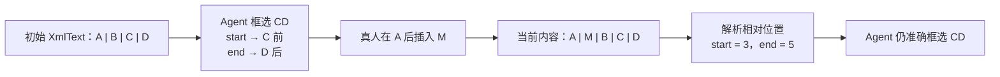

# 解决框选下标偏移的细节内容



## 1. Agent 如何控制光标和选区

Agent 没有浏览器里的真实光标，它维护的是一份“协作光标状态”：

```ts
type AgentCursorState = {
  actorId: string
  actorType: 'AGENT'
  name: string
  color: string
  anchor: Y.RelativePosition
  head: Y.RelativePosition
}
```

- 光标：`anchor === head`
- 选区：`anchor !== head`
- 选区方向由 `anchor` 与 `head` 保留
- 前端把该状态作为协作 Presence/Awareness 渲染成 Agent 光标、姓名标签与选区高亮

对于 `ABCD`，Agent 框选 `CD`：

```ts
import * as Y from 'yjs'

const start = Y.createRelativePositionFromTypeIndex(xmlText, 2, 0)
const end = Y.createRelativePositionFromTypeIndex(xmlText, 4, -1)
```

其中：

```text
初始文本：A B C D
绝对位置：0 1 2 3 4

选区：    [   C D   )
           2       4
```

此时不要持久化 `2` 和 `4`，而是持久化 `start` 与 `end` 的编码结果：

```ts
const startBytes = Y.encodeRelativePosition(start)
const endBytes = Y.encodeRelativePosition(end)
```

它们可以存为 PostgreSQL `bytea`，或 Base64 字符串。

当真人在 `A` 后插入 `M`：

```text
原文：ABCD
改后：AMBCD

原选区绝对下标：2..4
新选区绝对下标：3..5
```

Agent 在真正提交前重新解析：

```ts
const startAbsolute = Y.createAbsolutePositionFromRelativePosition(start, ydoc)
const endAbsolute = Y.createAbsolutePositionFromRelativePosition(end, ydoc)

if (!startAbsolute || !endAbsolute) {
  throw new Error('目标节点已经不存在')
}

const from = startAbsolute.index // 3
const to = endAbsolute.index     // 5
const current = xmlText.toString().slice(from, to) // CD
```

因此，插入发生在选区外部时，选区会自然随其所锚定的 CRDT 内容移动。

但相对位置只解决“位置跟随”，不保证“目标语义仍正确”。所以 Agent 提交前必须再验证局部指纹：

```ts
const expectedText = 'CD'
const expectedFingerprint = sha256(expectedText)

const actualText = xmlText.toString().slice(from, to)
if (sha256(actualText) !== expectedFingerprint) {
  return { status: 'CONFLICTED' }
}
```

例如：

```text
初始：ABCD
Agent 目标：CD

真人改为：ABXD
```

相对位置仍可能解析成功，但目标片段已不是 `CD`。此时 Agent 必须停止覆盖，重新读取局部内容。

所以完整原则是：

> RelativePosition 负责跟随内容；局部指纹负责防止错误覆盖。

## 2. 边界插入的语义

选区边界本身可能被并发插入，因此创建相对位置时要规定关联方向。

对“替换 `CD`”而言，通常期望：

```text
start：绑定到 C 一侧
end：绑定到 D 一侧
```

这样，选区中的原始内容仍是 `C` 到 `D`，而不是因为有人恰好在边界输入文字就被 Agent 一并替换。

这部分不要让各业务代码直接散落地传 `assoc` 参数。应封装为唯一的范围服务：

```ts
function createProtectedTextRange(xmlText: Y.XmlText, from: number, to: number) {
  return {
    start: Y.createRelativePositionFromTypeIndex(xmlText, from, 0),
    end: Y.createRelativePositionFromTypeIndex(xmlText, to, -1)
  }
}
```

后续通过协同测试固定边界规则，包括：

- 在选区前插入；
- 在选区后插入；
- 在选区起点插入；
- 在选区终点插入；
- 在选区内部插入；
- 删除整个选区；
- 删除选区所属节点。

### 2.1 跨 block 选区：不要求为普通 block 新增 `blockId`

`ABCD` 不一定处在同一个 `Y.XmlText`。在 Tiptap 文档中，换段、标题、列表项或其他块级节点都可能使：

```text
paragraph  -> Y.XmlText("ABC")
heading    -> Y.XmlText("D")
```

因此，跨 block 选区是正常情况。

但首发实现**不需要**为每一个 paragraph、heading、listItem 额外写入业务 `blockId`。Yjs 的 `RelativePosition` 已含有其所在 Yjs Item/Type 的稳定内部身份；Tiptap 的 `@tiptap/y-tiptap` 已能在 ProseMirror 文档位置与 Yjs RelativePosition 之间双向映射，且这个位置可以跨 block。

`blockId` 仅在需要下列业务能力时再引入：

- 对单个 block 做长期的业务引用、评论、权限或审核；
- 保存独立的 block revision；
- 将 block 作为可独立恢复、接受或拒绝的业务实体。

跨 block 的准备结果应保存两个端点及其语义校验材料，而不是保存全局文本下标：

```ts
type PreparedBlockRange = {
  start: Uint8Array // encodeRelativePosition(start)
  end: Uint8Array   // encodeRelativePosition(end)
  expectedTextFingerprint: string
  expectedStructureFingerprint: string
}
```

其中 `expectedStructureFingerprint` 至少覆盖选区经过的块类型、层级和顺序，例如 `paragraph -> bullet_list/list_item -> paragraph`。它不需要是持久化的 block ID 列表。

### 2.2 跨 block 的提交方式

跨 block 不能复用 `replaceIfUnchanged` 中对一个 `Y.XmlText` 的 `delete + insert`。该函数的 `start.type !== xmlText || end.type !== xmlText` 检查应继续保留，用来明确拒绝把跨节点范围误当成单节点文本范围。

跨 block 的流程应为：

```text
ProseMirror selection 的 from/to
  → 映射为两个 Y.RelativePosition
  → 保存文本指纹与结构指纹
  → 提交前重新映射为当前 ProseMirror from/to
  → 校验端点、结构、内容
  → 通过 Tiptap / ProseMirror transaction 替换该选区
  → Collaboration Binding 生成普通 Yjs update
```

也就是说，Yjs 负责端点跟随；结构化编辑仍应由与当前 Tiptap Schema 对齐的适配层完成。Agent 不应自行把跨节点的 XML 删除、节点拼接逻辑散落到业务代码中。

### 2.3 删除、合并和“局部最新”

如果同一文本 block 的 `ABC` 变为 `AB`，并且 Agent 的端点原来关联 `C`，Yjs 通常会把该相对位置解析到删除后的边界，而不是必然返回 `null`。所以“RelativePosition 可解析”不等于“目标仍然正确”：原本期望的 `C` 已不存在，文本指纹必须校验失败并返回 `CONFLICTED`。

如果整个 `C` 所在 block 或其祖先节点被删除，端点可能无法解析，此时同样返回 `CONFLICTED`。段落合并、拆分和列表层级调整也必须通过结构指纹校验；不能把端点仍可映射视为允许覆盖的理由。

“局部最新”可以把 block 区间 revision 作为**可选的快速冲突筛查**，但它不是最终正确性条件：

```text
区间 revision 未变化
  + 两个 RelativePosition 均可解析
  + 当前结构指纹一致
  + 当前局部文本指纹一致
  = 可以在同一文档串行执行器中提交
```

现有 Yjs update、op log 和 snapshot 都是文档级，不提供 block revision。只有产品确实需要 block 级审核/版本展示时，才由 Document Engine 对每次真人和 Agent 更新维护独立 revision；否则 RelativePosition 加局部指纹已经足够，并保持模型简单。

## 3. Agent 如何读取 Yjs XML 文档

Tiptap 的协作内容通常存放在：

```ts
const root = ydoc.getXmlFragment('content')
```

其内部不是一个普通字符串，而是类似这样的 Yjs XML 树：

```text
Y.XmlFragment(content)
└── Y.XmlElement(paragraph)
    └── Y.XmlText("ABCD")
```

复杂文档可能是：

```text
Y.XmlFragment(content)
├── Y.XmlElement(heading)
│   └── Y.XmlText("项目背景")
├── Y.XmlElement(paragraph)
│   └── Y.XmlText("ABCD")
└── Y.XmlElement(bullet_list)
    └── ...
```

Agent 不应该直接看到 Yjs 二进制，也不应自己生成 XML/Yjs 操作。

应由 TS Yjs Document Engine 把 Yjs XML 树投影为 Agent 可理解的结构：

```ts
type AgentDocumentProjection = {
  documentId: string
  blocks: Array<{
    ref: string
    type: 'heading' | 'paragraph' | 'listItem' | 'agentSection'
    text: string
    attributes: Record<string, string>
  }>
}
```

例如：

```json
{
  "documentId": "doc_001",
  "blocks": [
    {
      "ref": "block_7",
      "type": "paragraph",
      "text": "ABCD",
      "attributes": {}
    }
  ]
}
```

Agent 可以读到：

```text
[block_7]
ABCD
```

但模型不应直接提交：

```json
{ "from": 2, "to": 4 }
```

而应通过受控工具选择内容：

```text
selectText(block_7, "CD")
```

TS 引擎定位后生成并保存真实的 `RelativePosition`、局部指纹和上下文信息，返回一个不透明引用：

```json
{
  "rangeRef": "range_01J...",
  "selectedText": "CD"
}
```

Agent 后续只使用：

```text
replaceRange(range_01J..., "新的内容")
```

而不是接触 Yjs 内部坐标。

### 3.1 现有实现提供的基础与尚缺的能力

现有前端已经以 `Y.Doc + Y.XmlFragment('content')` 绑定 `@tiptap/extension-collaboration`，因此具备跨 block 位置映射和原始 Yjs update 同步的基础。Document WebSocket 也能持久化、确认和广播合法的 Yjs update。

但现有实现尚未提供下列 Agent 层能力，不能把“已有协作编辑器”误解为“已有 Agent 跨 block 编辑”：

- Agent 的 prepare / validate / commit 范围服务；
- Agent 光标、选区的 awareness 渲染；
- 跨 block 的结构指纹；
- Agent 作为受控写入者接入同一 update 链路；
- 每文档的 Agent 串行执行器。

这些能力应由 TS Yjs Document Engine 补齐；Java WebSocket 层继续只路由不透明的 Yjs 字节。

## 4. Agent 如何更新 Y.XmlText

小范围文本替换应在同一个 Yjs transaction 中完成：

```ts
function replaceIfUnchanged(
  ydoc: Y.Doc,
  xmlText: Y.XmlText,
  range: PreparedRange,
  replacement: string
) {
  const start = Y.createAbsolutePositionFromRelativePosition(range.start, ydoc)
  const end = Y.createAbsolutePositionFromRelativePosition(range.end, ydoc)

  if (!start || !end || start.type !== xmlText || end.type !== xmlText) {
    return { status: 'CONFLICTED', reason: '目标文本节点已经变化' }
  }

  const from = start.index
  const to = end.index
  const actual = xmlText.toString().slice(from, to)

  if (sha256(actual) !== range.expectedFingerprint) {
    return { status: 'CONFLICTED', reason: '目标内容已被修改' }
  }

  ydoc.transact(() => {
    xmlText.delete(from, to - from)
    xmlText.insert(from, replacement)
  }, {
    source: 'agent',
    agentRunId: range.agentRunId
  })

  return { status: 'APPLIED' }
}
```

这次 transaction 产生的就是普通 Yjs update：

```ts
const update = Y.encodeStateAsUpdate(ydoc, beforeStateVector)
```

它应与真人编辑产生的 update 走同一条链路：

```text
Agent Yjs transaction
  → Yjs binary update
  → PostgreSQL update log
  → WebSocket 广播
  → 真人客户端 applyUpdate
  → Tiptap 自动刷新
```

Agent 不是旁路写数据库，也不是把全文覆盖回去；它是一个受控的虚拟协作者。

## 5. Agent 如何更新 XML 节点

这里建议区分两类操作。

### 文本级操作

操作目标是既有 `Y.XmlText`：

```ts
xmlText.insert(index, text)
xmlText.delete(index, length)
xmlText.applyDelta(delta)
```

适用于：

- 替换句子；
- 改写段落；
- 添加行内文本；
- 保留原有段落结构。

首发版本优先只开放这一类操作。

### 结构级操作

操作目标是 `Y.XmlFragment` 或 `Y.XmlElement`：

```ts
const section = new Y.XmlElement('agentSection')
section.setAttribute('sectionId', crypto.randomUUID())
section.setAttribute('agentRunId', agentRunId)
section.setAttribute('status', 'draft')

const paragraph = new Y.XmlElement('paragraph')
const text = new Y.XmlText()
text.insert(0, 'Agent 生成的草稿内容')

paragraph.insert(0, [text])
section.insert(0, [paragraph])

root.insert(targetBlockIndex + 1, [section])
```

这对应“区域开辟”。

但 `agentSection` 必须是 Tiptap Schema 中正式声明的节点，不能只是服务端临时拼装的未知 XML 标签。否则前端在同步、复制、编辑或重新序列化时可能丢失它的属性。

建议它至少包含：

```text
agentSection
├── sectionId
├── agentRunId
├── status: drafting | ready | accepted | conflicted
├── title
└── content
```

它可以在 UI 中呈现为：

```text
┌─ Agent 草稿：方案补充 ──────────┐
│  当前状态：待确认               │
│                                 │
│  ... Agent 生成的大段内容 ...   │
└─────────────────────────────────┘
```

### 5.1 保持简单的“开辟区域”首发方式

当前前端已注册 Tiptap StarterKit 的 paragraph、heading、list 等常规节点，以及行内 `resourceReference`。因此，即使尚未增加 `agentSection` Schema，Agent 也可以在一个 RelativePosition 锚点后插入由现有节点组成的普通草稿：

```text
## Agent 草稿

第一段草稿内容

- 补充项一
- 补充项二
```

这已经具备“在当前位置开辟内容区域”的前置能力，不需要为首发增加新的文档节点。对应的 `agentRunId`、生成状态和审计信息可先保存在文档外的 Agent 业务记录中，区域起止位置使用 RelativePosition 保存。

代价是该区域只是普通文档内容：用户可以移动、拆分、混合编辑它，不能原生支持卡片边框、接受/拒绝、独立权限或稳定的区域业务身份。只有产品明确需要这些语义时，才增加正式的 `agentSection` 节点和对应 Tiptap Node/NodeView。

### 5.2 大文本生成：一个 Tool，内部受控分批写入

可以只给 Agent 暴露一个高层工具：

```text
insertLargeContent(anchorRef, content)
```

Tool 内部而不是模型侧负责分批：

```text
1. 先插入很小的标题/草稿起点，并标记为 drafting
2. 按实际编码后的 Yjs update 字节数切分 content
3. 每个分块只生成一个小的 Yjs transaction
4. 等待该分块得到 UPDATE_ACCEPTED 后，再发送下一块
5. 全部成功后将外部 Agent run 标记为 ready
```

分块必须以 `Y.encodeStateAsUpdate` 后的**实际字节数**为依据，不能只以字符数或 token 数为依据。当前 Document WebSocket 对单条 Yjs update 有 256 KiB 的硬上限；Agent Writer 应使用更保守的内部目标（例如 192 KiB），为富文本属性、协议封装和部署侧消息限制留余量。

大文本分批写入的语义是“渐进可见”，不是全有或全无：前几块已经 ACK 后若任务失败，用户会看到部分草稿。因此失败时应在外部 Agent run 中标记失败/部分完成，不能在未重新校验的情况下删除可能已经被用户编辑的内容。

现有浏览器协作客户端会将每次 `ydoc.update` 立即放入待确认队列，并没有“等待上一块 ACK 再写下一块”的 Agent 专用调度。因此该顺序、大小测量和失败状态必须由 Agent Writer / TS Document Engine 实现。

## 6. XML 直接操作的边界

Yjs XML 很适合做底层精确更新，但 Agent 不应自由拼装任意 XML。

首发建议限制为：

- 既有 `Y.XmlText` 的局部替换；
- 固定结构的 `agentSection` 插入；
- 固定结构的段落、标题、列表生成；
- 所有富文本、表格、图片、引用等复杂节点，后续通过专门的 Tiptap / ProseMirror 适配层生成。

特别是富文本格式，`Y.XmlText` 需要通过 Delta 表达：

```ts
xmlText.applyDelta([
  { insert: '重点内容', attributes: { bold: true } }
])
```

不要把 HTML 字符串直接塞进 `Y.XmlText`，也不要让模型自行构造 Yjs update 二进制。

## 7. 单机版最重要的约束

单机版本中，每个文档应有一个串行执行器：

```text
真人 Yjs update
Agent 光标更新
Agent prepare replace
Agent commit replace
Agent open section
```

这些动作按文档顺序进入同一队列。这样 Agent 在“重新解析锚点 → 校验指纹 → XML transaction”之间不会被另一条 Agent 写入打断。

真人编辑仍可持续进入队列；真人修改同一目标时，Agent 的局部校验失败并进入冲突，而不是覆盖真人内容。

最终可以把 Agent 的操作模型收敛成一句话：

> Agent 读取的是 Yjs XML 的语义投影，保存的是相对位置，提交的是经过局部指纹校验的 Yjs transaction。
